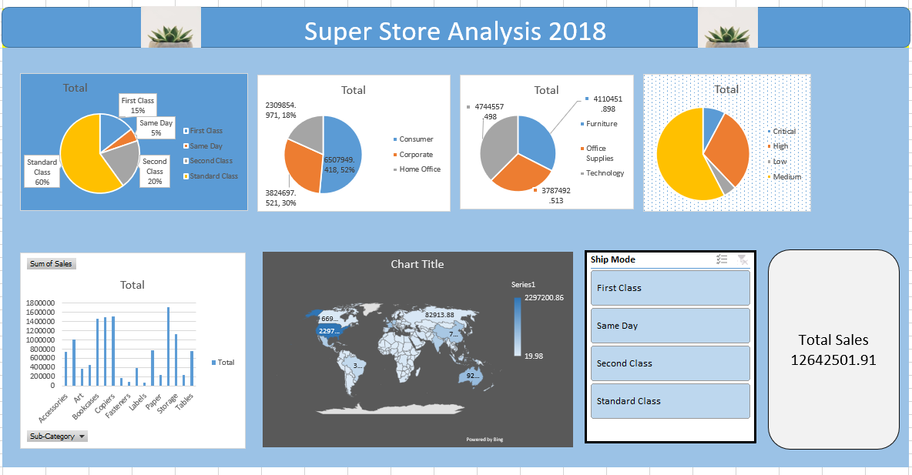

# Sales Overview Dashboard - Global Superstore

## 📌 Project Overview
This dashboard provides a visual summary of the Global Superstore dataset. It was built to demonstrate how raw data can be organized into an interactive report using Excel's native features. The focus of this project is on data organization, effective use of Pivot Tables, and user-friendly dashboard design.

## 📊 Key Metrics Featured
* **Total Sales:** Overall revenue generated by the store.
* **Profitability:** Calculation of net profit to track financial health.
* **Quantity:** Total units sold across different segments.
* **Shipping Mode Distribution:** A breakdown of how customers choose to receive their orders.

## 🛠️ Excel Features Used
* **Pivot Tables:** Used to aggregate and summarize thousands of rows of data into meaningful categories.
* **Interactive Slicers:** Added to allow users to filter the data by Market, Region, and Category dynamically.
* **Map Visualizations:** Utilized Excel’s Map Chart feature to provide a geographic overview of sales, allowing for easy identification of high-performing countries.
* **Dashboard Design & Layout:** * Used custom shapes and formatting (Paint/Drawing tools) to create a clean, modern UI.
    * Aligned charts and slicers for a professional look.
    * Removed gridlines and headers to give the spreadsheet a "software-like" feel.
* **Excel Charts:** Utilized Doughnut and Bar charts to visualize proportions and comparisons.

## 💡 Quick Insights from the Data
* **Market Leaders:** The dashboard highlights which global markets contribute the most to the total revenue.
* **Product Mix:** You can quickly see which categories (Technology, Furniture, Office Supplies) are the primary drivers of profit.
* **Shipping Preferences:** Most customers prefer "Standard Class," which is a key insight for logistics planning.

## 🚀 How to View
1. Download the `global-sales-overview.xlsx` file.
2. Open the file in **Microsoft Excel**.
3. Use the **Slicers** on the dashboard to interact with the visualizations.
