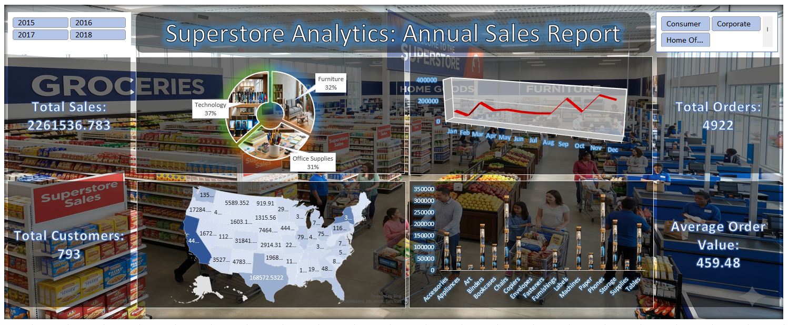

# 📊 Sales Overview Dashboard | Superstore Analysis

This project presents a comprehensive **Sales Overview Dashboard** built using Excel, focusing on key business metrics and performance insights from a retail dataset.

---

## 💡 Project Objective

The objective of this project is to analyze sales performance and uncover actionable insights related to revenue, customer behavior, and product categories.

---

## 📁 Project Structure

- 📄 `superstore-sales-data.xlsx` → Dataset and dashboard  
- 🖼️ `sales-dashboard.png` → Dashboard preview  
- 📘 `README.md` → Project documentation  

---

## 📊 Key Performance Indicators (KPIs)

- **Total Sales:** 2,261,536+  
- **Total Orders:** 4,900+  
- **Total Customers:** 700+  
- **Average Order Value:** 459+  

---

## 📈 Dashboard Features

- 📅 Year-wise filtering using slicers  
- 🧾 Category-wise sales distribution (Technology, Furniture, Office Supplies)  
- 📍 Region/State-wise sales visualization  
- 📊 Monthly sales trend analysis  
- 📦 Product category performance comparison  

---

## 🔍 Key Insights

- Technology category contributes the highest share of total sales (~37%), indicating strong demand.  
- Sales show fluctuations across months, highlighting seasonal trends in customer purchasing behavior.  
- Certain regions generate higher sales volumes, suggesting location-based demand concentration.  
- Despite a high number of orders, the average order value indicates mid-range purchasing patterns.  

---

## 🛠️ Tools & Techniques Used

- Microsoft Excel  
  - Pivot Tables  
  - Pivot Charts  
  - Slicers  
  - Data Cleaning & Transformation  

---

## 🎯 Business Impact

This dashboard helps stakeholders to:
- Monitor overall sales performance  
- Identify high-performing product categories  
- Understand regional sales distribution  
- Make data-driven decisions for growth  

---

## 🔗 Dataset Source

Dataset sourced from Kaggle.

---

## 🚀 Conclusion

This project demonstrates my ability to transform raw data into meaningful insights using visualization techniques and business understanding.

---

> From raw data to actionable insights — building my journey into Data Analytics 🚀
